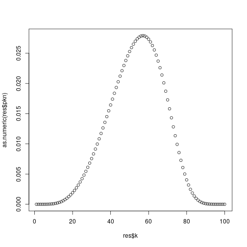

<!-- README.md is generated from README.Rmd. Please edit that file -->


# RGibbsTypePriors

<!-- badges: start -->
<!-- badges: end -->

The goal of RGibbsTypePriors is to Compute clusters prior distribution for Gibbs-type processes


## Installation

You can install the released version of RGibbsTypePriors from [CRAN](https://CRAN.R-project.org) with:

``` r
install.packages("RGibbsTypePriors")
```

And the development version from [GitHub](https://github.com/) with:

``` r
# install.packages("devtools")
devtools::install_github("konkam/RGibbsTypePriors")
```
## Example

This is a basic example which shows you how to solve a common problem:




